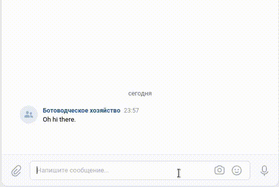

# Dialogflow User Support Bots

## About

This project demonstrates the usage of [Dialogflow](https://Dialogflow.cloud.google.com/) natural language processing service with two simple bots for Telegram and VKontakte. Both bots utilizes Dialogflow API to find corresponding answers to user's questions given to any of these bots. Project contains three scripts there each one might be used standalone: Telegram bot, VKontakte bot, and a script for automated creation of Dialogflow intents (possible conversation cases).

How it looks in Telegram:


How it looks in VKontakte:


This project created for educational purposes as part of an online course for web developers at [dvmn.org](https://dvmn.org/)

## Preparing project to run

1. Download files from GitHub with `git clone` command:
```
git clone https://github.com/SergIvo/dvmn-Dialogflow-bot
```
2. Create virtual environment using python [venv](https://docs.python.org/3/library/venv.html) to avoid conflicts with different versions of the same packages:
```
python -m venv venv
```
3. Then install dependencies from "requirements.txt" in created virtual environment using `pip` package manager:
```
pip install -r requirements.txt
```
4. To run the project scripts, you should first set some environment variables. To make environment variable management easier, you can create [.env](https://pypi.org/project/python-dotenv/#getting-started) file and store all variables in it. Variables, listed further, are necessary for running any script in the project:
```
export DF_PROJECT_ID="your Dialogflow project ID"
export GOOGLE_APPLICATION_CREDENTIALS="path to credentials for Google Cloud API"
```
You can find Dialogflow project ID in the settings of your Dialogflow agent. Or, if you created your project in Google Cloud Console and then linked it to Dialogflow agent, you can copy project ID from Google Cloud Console.
To generate Google application credentials you shoud follow [this tutorial](https://cloud.google.com/dialogflow/es/docs/quick/setup#client-library-user-account-authentication).

## Running scripts

### Telegram bot
To run Telegram bot, you should additionally set two environment variables:
```
export TG_API_KEY="your Telegram API key"
export TG_LOG_CHAT_ID="ID of the chat to there bot will log service information (warnings, error messages, etc.)"
```
Then run bot with the following command:
```
python telegram_bot.py
```

### VKontakte bot
To run VKontakte bot, you should additionally set two environment variables:
```
export VK_GROUP_TOKEN="API key of VKontakte group in which bot supposed to respond in the group chat"
export TG_API_KEY="your Telegram API key, needed by logger"
export TG_LOG_CHAT_ID="ID of the chat to there bot will log service information (warnings, error messages, etc.)"
```
Then run bot with the following command:
```
python vk_bot.py
```

### Script for creating Dialogflow intents
This script creates intents from description given in the form of JSON-file. Script accepts relative path or full path to this file as the only argument. Intents should be descripted as following:
```json
{
    "intent name by your choice": {
        "questions": [
            "possible user question text 1",
            "question text 2",
            ...
            "last question text",
        ]
        "answer": "bot answer text"
    },
    ...
}
```
You can read more about Dialogflow intents [here](https://cloud.google.com/dialogflow/es/docs/intents-overview).
To run script, execute the following command:
```
python intents_from_file.py "path-to-JSON-file"
```

